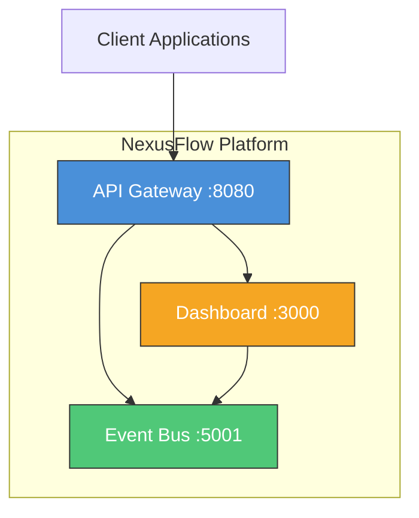
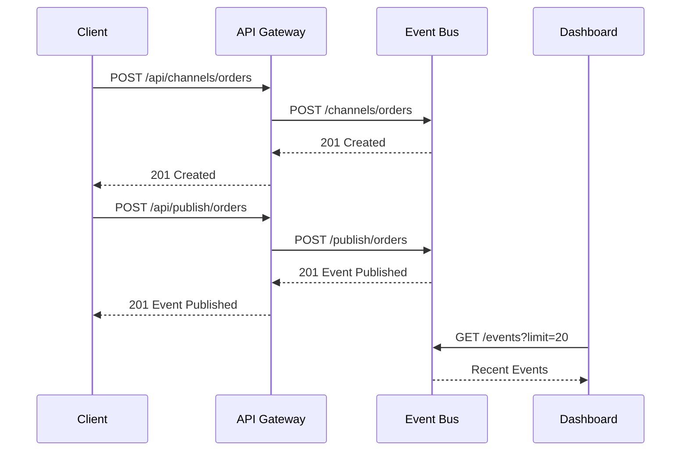

# NexusFlow Platform

An event-driven microservice messaging platform with API gateway, event bus, and real-time dashboard.

## Overview

NexusFlow is a lightweight, self-hosted event-driven platform that enables microservices to communicate through channels and events. It consists of three services:

- **Event Bus** (Python/Flask) — Core messaging engine with channel-based pub/sub
- **API Gateway** (Go) — Unified entry point with request routing, CORS, and upstream health checks
- **Dashboard** (TypeScript/Express) — Real-time monitoring and service health visualization

## Architecture



### Data Flow



## Quick Start

### Prerequisites

- Docker and Docker Compose
- Make (optional)

### Start All Services

```bash
# Clone the repository
git clone https://github.com/mohadayo/nexusflow-platform.git
cd nexusflow-platform

# Copy environment file
cp .env.example .env

# Start all services
make up
# or
docker compose up -d --build
```

### Verify Services

```bash
# Check all health endpoints
make health

# Or individually
curl http://localhost:8080/health   # API Gateway
curl http://localhost:5001/health   # Event Bus
curl http://localhost:3000/health   # Dashboard
```

## API Reference

### API Gateway (port 8080)

| Method | Endpoint | Description |
|--------|----------|-------------|
| GET | `/health` | Gateway health check |
| GET | `/routes` | List configured routes |
| GET | `/upstream/health` | Check upstream service health |
| * | `/api/*` | Proxy to upstream services |

### Event Bus (port 5001)

| Method | Endpoint | Description |
|--------|----------|-------------|
| GET | `/health` | Service health check |
| GET | `/channels` | List all channels |
| POST | `/channels/<name>` | Create a channel |
| POST | `/publish/<channel>` | Publish event to channel |
| POST | `/subscribe` | Subscribe to a channel |
| GET | `/subscribers` | List all subscribers |
| GET | `/events` | List recent events (supports `?limit=N&channel=name`) |
| GET | `/events/<channel>` | List events for a channel |
| GET | `/stats` | Platform statistics |

### Dashboard (port 3000)

| Method | Endpoint | Description |
|--------|----------|-------------|
| GET | `/health` | Service health check |
| GET | `/dashboard` | Dashboard overview |
| GET | `/metrics` | Platform metrics |
| GET | `/services` | Service status checks |
| GET | `/events/recent` | Recent events from event bus |

## Usage Examples

### Create a Channel and Publish Events

```bash
# Create a channel
curl -X POST http://localhost:8080/api/channels/notifications

# Publish an event
curl -X POST http://localhost:8080/api/publish/notifications \
  -H "Content-Type: application/json" \
  -d '{"type": "alert", "message": "Server CPU > 90%", "severity": "high"}'

# Subscribe to channel
curl -X POST http://localhost:8080/api/subscribe \
  -H "Content-Type: application/json" \
  -d '{"channel": "notifications", "callback_url": "http://myapp.local/webhook"}'

# Get recent events
curl http://localhost:8080/api/events?limit=10

# Get platform stats
curl http://localhost:8080/api/stats
```

## Development

### Run Tests

```bash
# All tests
make test

# Individual services
make test-python   # Event Bus
make test-go       # API Gateway
make test-ts       # Dashboard
```

### Run Linters

```bash
# All linters
make lint

# Individual services
make lint-python
make lint-go
make lint-ts
```

### Project Structure

```
nexusflow-platform/
├── api-gateway/          # Go API Gateway service
│   ├── main.go
│   ├── main_test.go
│   ├── go.mod
│   └── Dockerfile
├── event-bus/            # Python Event Bus service
│   ├── app.py
│   ├── test_app.py
│   ├── requirements.txt
│   └── Dockerfile
├── dashboard/            # TypeScript Dashboard service
│   ├── src/
│   │   ├── app.ts
│   │   ├── app.test.ts
│   │   └── index.ts
│   ├── package.json
│   ├── tsconfig.json
│   └── Dockerfile
├── docker-compose.yml
├── Makefile
├── .env.example
├── .gitignore
└── README.md
```

## Environment Variables

| Variable | Default | Description |
|----------|---------|-------------|
| `EVENT_BUS_PORT` | `5001` | Event Bus listen port |
| `GATEWAY_PORT` | `8080` | API Gateway listen port |
| `DASHBOARD_PORT` | `3000` | Dashboard listen port |
| `LOG_LEVEL` | `INFO` | Logging level (DEBUG, INFO, WARN, ERROR) |
| `MAX_EVENT_LOG` | `1000` | Maximum events retained in memory |
| `FLASK_DEBUG` | `false` | Enable Flask debug mode |
| `EVENT_BUS_URL` | `http://localhost:5001` | Event Bus URL (for inter-service communication) |
| `DASHBOARD_URL` | `http://localhost:3000` | Dashboard URL |
| `GATEWAY_URL` | `http://localhost:8080` | Gateway URL |

## CI/CD

GitHub Actions CI pipeline runs on every push and PR to `main`:

1. **test-python** — Lint (flake8) and test (pytest) the Event Bus
2. **test-go** — Vet and test the API Gateway
3. **test-typescript** — Lint (eslint) and test (jest) the Dashboard
4. **docker-build** — Build all Docker images

> **Note**: The `.github/workflows/ci.yml` file may need to be manually added after initial repository setup due to GitHub API constraints.

## License

MIT
